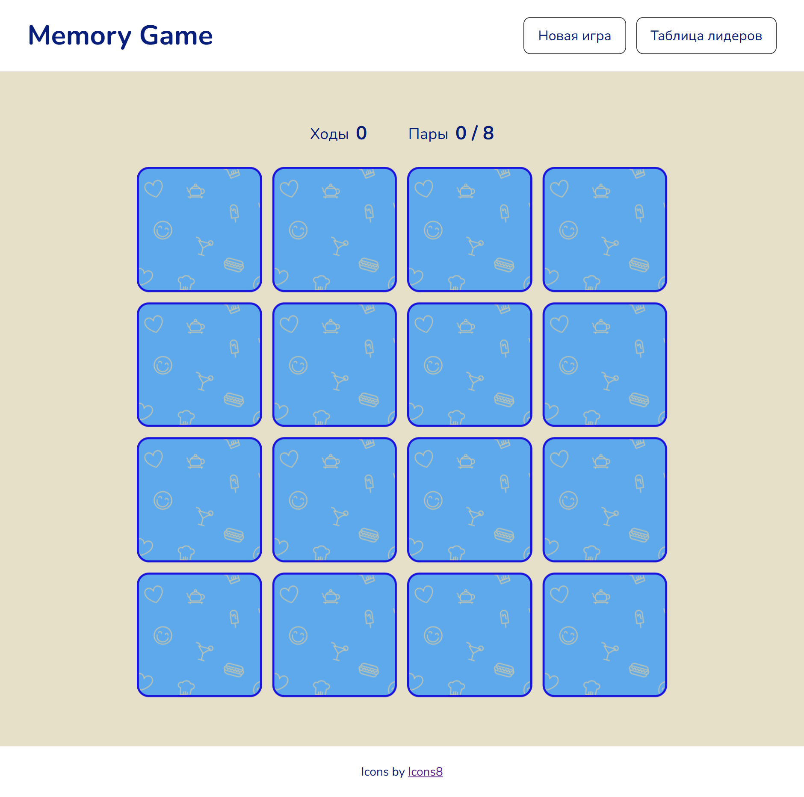
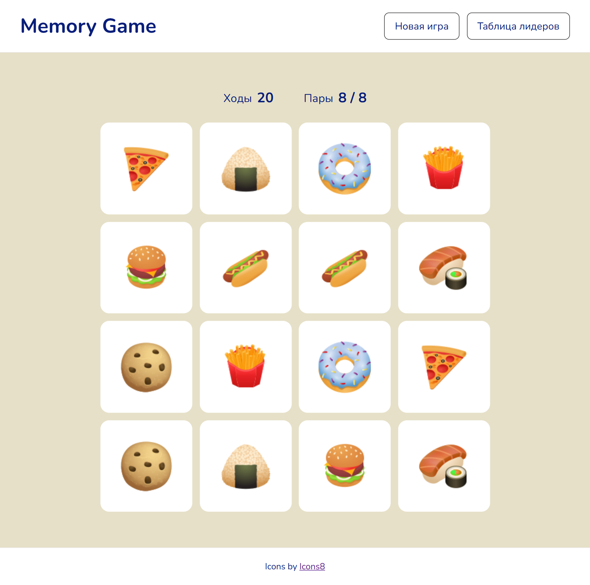

# Memory Game

Интерактивная игра на запоминание пар карточек, разработанная на чистом
JavaScript без использования фреймворков и сторонних библиотек для
игровой логики.

Цель игры - открыть все пары карточек, сделав как можно меньше ходов.

------------------------------------------------------------------------

## Screenshot

<table>
  <tr>
    <td></td>
    <td></td>
  </tr>
</table>

------------------------------------------------------------------------

🔗 Live Demo: https://tatiana-golub.github.io/memory-game/

------------------------------------------------------------------------

## Возможности

-   16 карточек и 8 пар изображений
-   Случайное перемешивание карточек при запуске и начале новой игры
-   Проверка совпадения выбранных карточек
-   Счётчик ходов
-   Счётчик найденных пар
-   Автоматическое закрытие несовпавших карточек через 1 сек.
-   Блокировка выбора других карточек во время ожидания закрытия
    несовпавшей пары
-   Игнорирование повторного нажатия на уже открытую или найденную
    карточку
-   Модальное окно с результатом после завершения игры
-   Кнопка «Новая игра»
-   Таблица лидеров с 10 лучшими результатами
-   Сохранение результатов в `localStorage`
-   Сортировка результатов по количеству ходов и времени завершения игры
-   Адаптивная верстка для разных размеров экрана
-   Использование нативного элемента `<dialog>` для модальных окон

------------------------------------------------------------------------

## Технологии

-   HTML5
-   CSS3
-   JavaScript (ES6+)
-   ES Modules
-   DOM API
-   CSS Grid
-   Flexbox
-   `localStorage`
-   Native `<dialog>` API

------------------------------------------------------------------------

## Структура проекта

``` text
memory-game/
├── assets/
│   └── ...
├── css/
│   └── styles.css
├── js/
│   ├── utils/
│   │   ├── createButton.js
│   │   ├── createElement.js
│   │   └── getMovesWord.js
│   ├── cardsData.js
│   ├── game.js
│   ├── main.js
│   ├── modal.js
│   └── storage.js
├── favicon.ico
├── index.html
└── README.md
```

------------------------------------------------------------------------

## Установка и запуск

Клонируйте репозиторий:

``` bash
git clone https://github.com/Tatiana-Golub/memory-game.git
cd memory-game
```

Запустите проект через **Live Server** или другой локальный сервер
разработки.

